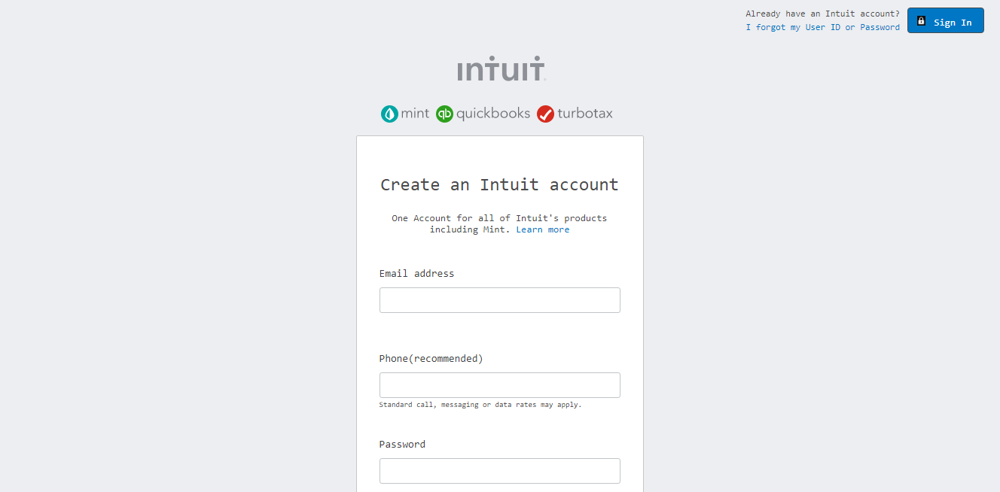
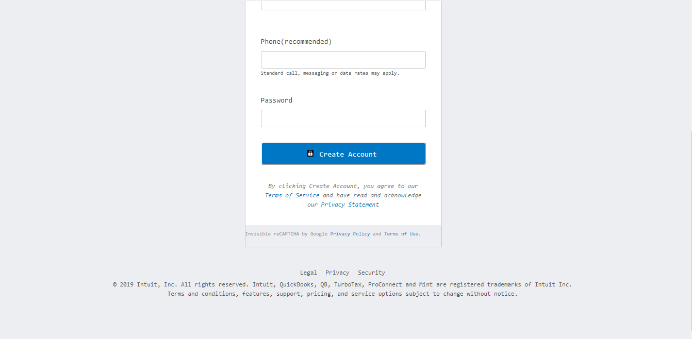
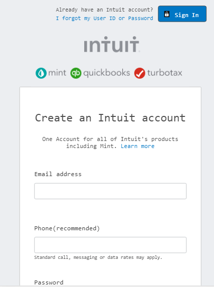
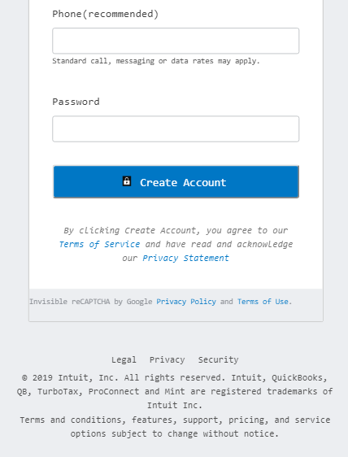
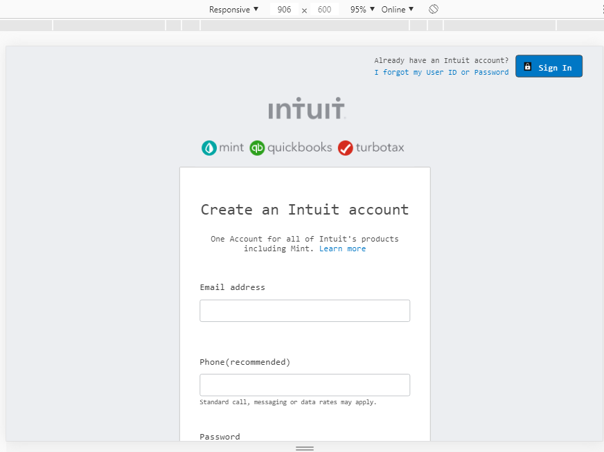
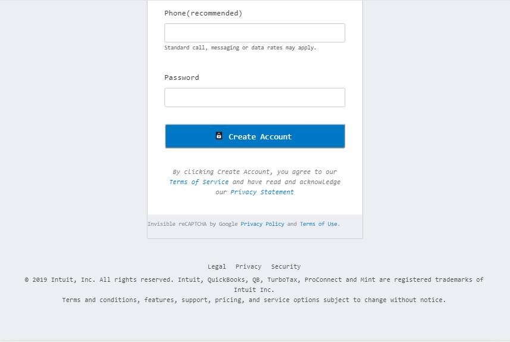
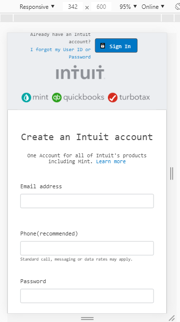

# Designing a sign up form with HTML and CSS


> A practical demonstration of designing an HTML form. This project is designed to look similar to [mint.com's sign up form](https://accounts.intuit.com/signup.html), for the purpose of practical demonstration. The project is part of a series of projects to be completed by students of [Microverse](https://www.microverse.org/ "The Global School for Remote Software Developers!").


## Technologies


- HTML
- CSS

## Future Feature (V1.2)

- Add validation to form
- Display exact error messages

## Screenshots









## Usage


> Clone the repository to your local machine

```sh
$ git clone https://github.com/addod19/HTML-FORMS.git
```

cd into the repositiory

```sh
$ cd HTML-FORMS
```
> open index.html with your favourite web browser

> Explore our site

## Deployment


You can find the demo page [HERE](https://raw.githack.com/addod19/HTML-FORMS/dev/index.html)

## Authors

👤 **Author1**

- Github: [@addod19](https://github.com/addod19)
- Twitter: [@DanielLarbiAdd1](https://twitter.com/DanielLarbiAdd1)
- Linkedin: [Daniel Larbi Addo](https://linkedin.com/in/daniel-larbi-addo/)
- Email: (addodaniellarbi@gmail.com)


## Contributing 

Contributions, issues and feature requests are welcome!

Feel free to check the [issues page](https://github.com/addod19/Restaurant-Page/issues).

1.  Fork it (https://github.com/addod19/HTML-FORMS/fork)
2.  Create your feature branch (git checkout -b feature/[choose-a-name])
3.  Commit your changes (git commit -m "what we are commiting")
4.  Add to the branch (git add .)
5.  Push to the branch (git push origin feature/[chosen name])
6.  Create a new pull request

## Show your support

Give us a ⭐️ if you like this project!

## Acknowledgments

- MICROVERSE
- MICROVERSE TSE's
- MINT

## License
----

This project is licensed under the MIT License - see the [LICENSE](./LICENSE.md) file for details
